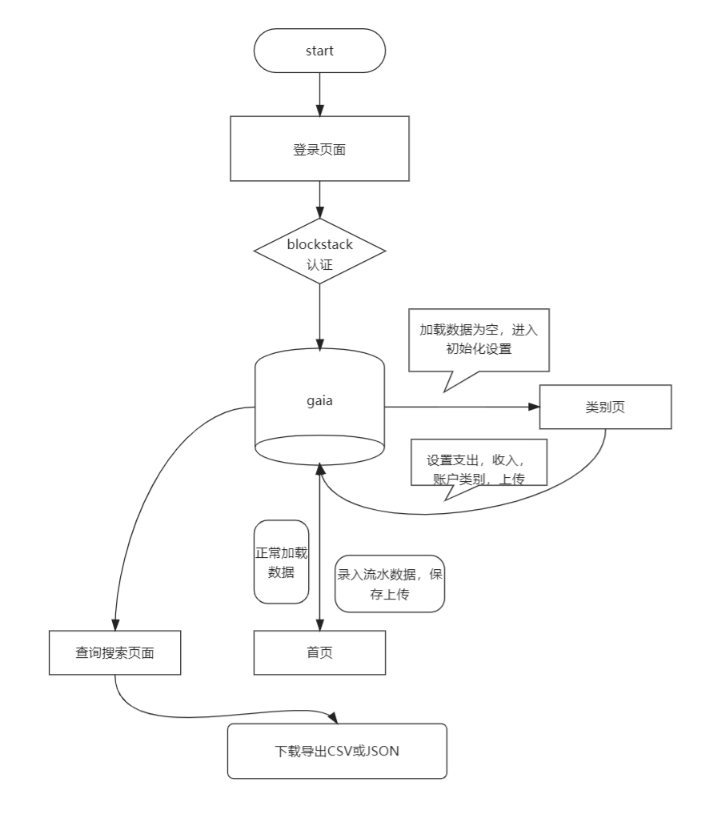
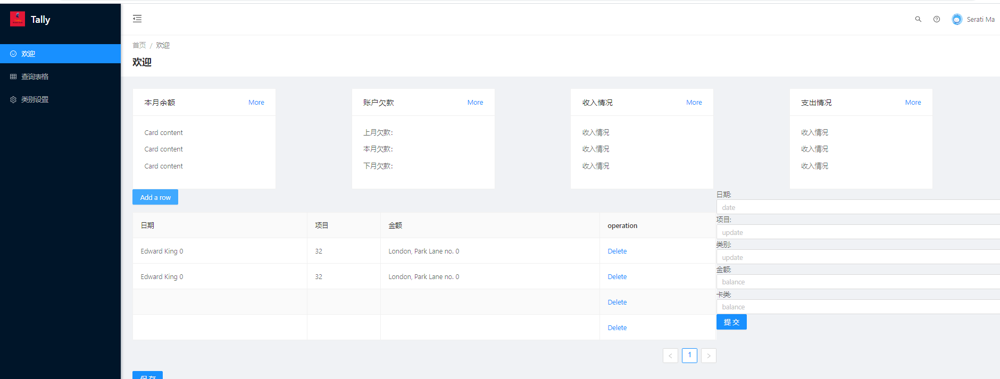
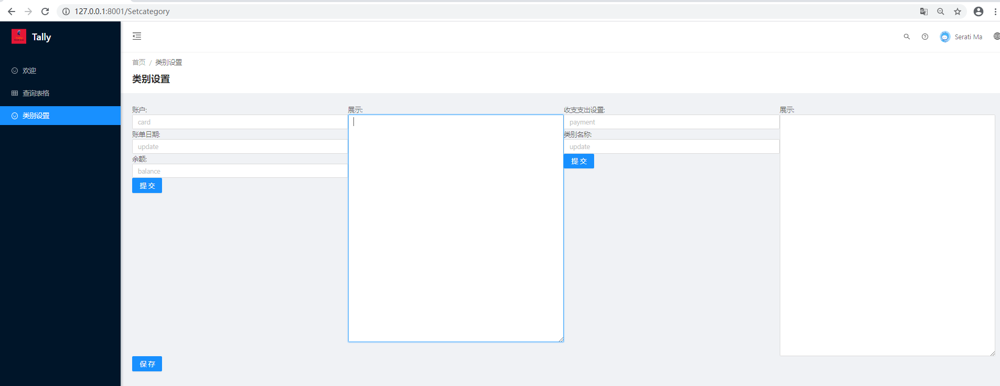

# Tally项目计划书

<div align=center></div>

## **0、摘要**

Tally 是一个基于 Blockstack 开源的记账平台，它允许任何人轻松地创建并维护自己的账本，无需中间服务商。

Tally 账本的主人使用自我主权的身份来授权登录或维护账本，账本的信息通过加密算法进行保存在用户自己的私有存储空间内，只有主人自己（或者获得主人授权的第三方）才能将数据解密查看，使得数据永远掌握在账本主人手里。

每个人都需要有一个自己掌控的账本，Tally 可以成为每个记账人的好帮手。

## **1、背景**

我们忙碌于日常的开支，却很少关注一个问题：我们的钱去哪里了？如果我们能知道钱花到哪里了，是不是可以更加合理地规划？让手里的钱能最大化地发挥其作用。如何知道钱花到哪里去了？记账！只有记账，才能清楚钱的去向！

目前市场上虽已有多种记账软件，但几乎都是由中心化服务器来保存我们的帐本信息。一直以来，我们都习惯于中心化集权机构制定的规则，我们信任它们，将自己的信息、资产存储在这些机构中，相信能得到妥善保管。

然而，事实恰好相反，越是中心化集权机构，越存在如下风险：

容易成为黑客攻击的目标
一旦中心化服务器被黑客攻破，我们的敏感信息将暴露，如果我们习惯用一个相同的密码访问互联网各个应用、网站，那么黑客可以通过“撞库”去盗取我们的账号、甚至资产。没有一个中心化系统是绝对的安全。

中心化服务提供商作恶
我们将数据存储在中心化服务提供商的服务器上，无人监管，在利益的诱惑下，服务提供商有可能将用户的信息贩卖。不难想象如果我们的账本数据被别有用心之人经过大数据分析之后，我们会得到多少广告的眷顾。

数据丢失、被篡改
中心化服务提供商可以篡改我们的数据，甚至如果服务停止，我们的数据将再无法找回。

区块链网络本质上是由全球众多计算机组成的去中心化网络，该网络中的每台计算机都是一个服务器，它们存储着网络上发生的交易，通过一定的共识算法，一定的激励机制，使得这些交易不可逆、不可篡改。这时，要想攻击这个网络，难度将呈指数级上升，攻击动力大大减小，我们存在区块链上的数据、资产，安全性方面，得到巨大的保证。

同时，在这样的网络中，我们的信息、资产将由自己来掌控，我们的信息将使用自己的私钥加密，没有私钥无法打开、查看，任何应用或个人想要获取我们的信息，需要得到我们的授权。我们来决定谁可以查看我们的信息，谁可以使用我们的信息。我们的在这样的网络里，我们的身份有了一种全新的定义——自我主权身份（Self-Sovereign Identity，SSI），这是在中心化集权系统中不能给予我们的。

账本作为收入支出的敏感信息，非常适合搭建在这样的网络中，安全，没有信息泄露的风险，用户用得放心，这正是 Tally 记账本诞生的意义。

## **2 、愿景**

Tally旨在通过使用区块链技术，让用户方便地创建真正属于自己的账本，在此基础上，通过直观的图表、统计，让用户清楚地看到资金的流向，改善我们的消费习惯，让用户手里的资金最大化地发挥作用，我们希望Tally成为每个人的好帮手。

## **3、详细设计**
* 登录页
  * blockstack身份证认证
  * giai数据加载与判断category.json，cardservices.json，water-bill.json；category.json，cardservices.json为空跳转类别设置页面
* 首页
  * 本月支出收入余额统计
  * 圆形图表显示支出、收入占比
  *  本月、上月、下月信用卡（贷记账户）欠款统计显示
  *  流水账录入模块
  *  流水账单保存上传gaia
* 查询页面
  * 柱形图表或折线图表显示月度显示支出、收入
  * 搜索查询限定时间、类别、项目的流水
  * 下载导出流水账单为CSV或JSON格式
* 类别设置页面
  * 设置收入支出类别
  * 设置银行账户类别
  * 呈现类别设置结果
  * 自定义JSON设置类别信息**？？？**
  * 保存数据上传gaia

## 流程图

## 设计原型
* **首页**

* **类别页**



## 数据结构定义
```json
/*设置类别 Setcategory  */
/*收入与支出类别 category.json 不限制内容设定，限制结构设定 */
{
    "payment":[
        {"name":"餐饮"},
        {"name":"娱乐"},
        {"name":"学习"},
        {"name":"交通"},
        {"name":"通讯"},
        {"name":"其他"}
    ],
    "revenue":[
         {"name":"工资"},
         {"name":"业务"},
         {"name":"投资"}
    ],
    "disregard":[
         {"name":"信用卡还款"},
         {"name":"卡内转账"},
         {"name":"还贷款"}
    ]
}
/*账户类别 cardservices.json 不限制内容设定，限制结构设定 */
{
  "credit": [ //贷记账户
    {
      "card": "邮储3758",
      "update": "18", //信用卡账单日期
      "balance": "-11"
    },
    {
      "card": "花呗",
      "update": "31",
      "balance": "-11"
    }
  ],
  "debit": [ //借记账户
    {
      "card": "余额宝",
      "update": "31",
      "balance": "100"
    },
    {
      "card": "建行5909",
      "update": "31",
      "balance": "200"
    }
  ]
}

/*  流水账单 waterbill.json   限制内容类型设定  */
[
    {
        "date": "20200415",
        "item": "加油",
        "type": "交通",
        "amount": "-200",
        "card": "农行"
    },
    {
        "date": "20200415",
        "item": "吃饭",
        "type": "饭",
        "amount": "-15",
        "card": "花呗"
    },
    {
        "date": "20200415",
        "item": "吃饭",
        "type": "饭",
        "amount": "-100",
        "card": "花呗"
    },
    {
        "date": "20200415",
        "item": "买玩具",
        "type": "其他",
        "amount": "-100",
        "card": "建行8136"
    },
    {
        "date": "20200415",
        "item": "newsgetdata",
        "type": "通讯",
        "amount": "-1000",
        "card": "农行7171"
    }
]

```


Install `node_modules`:

```bash
yarn install
```

### Start project

```bash
yar start
```

### Build project

```bash
yarn run build
```

